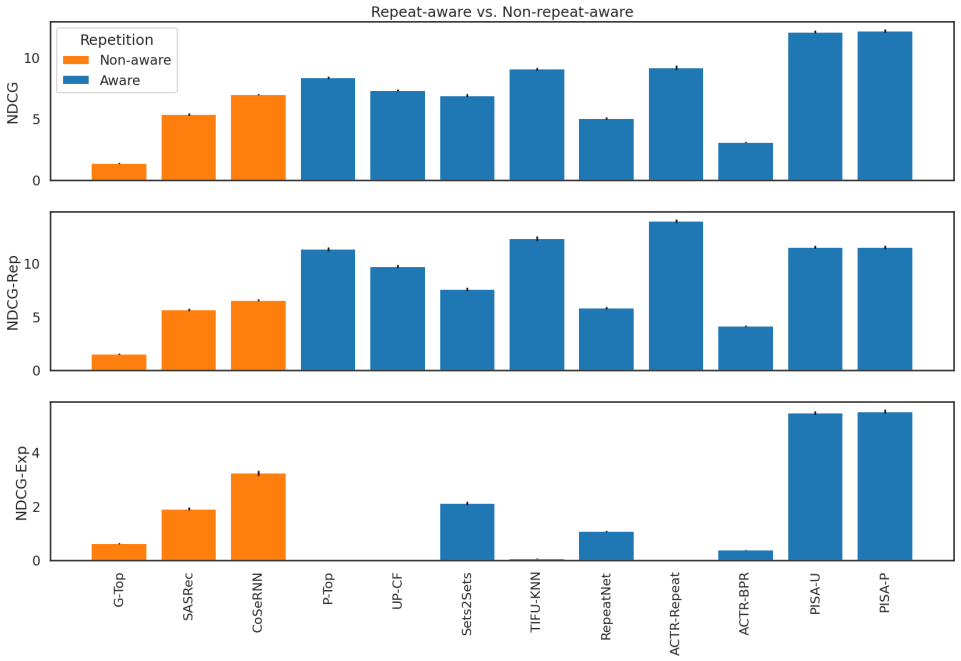
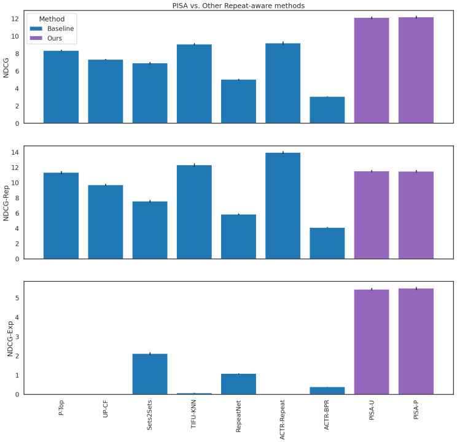
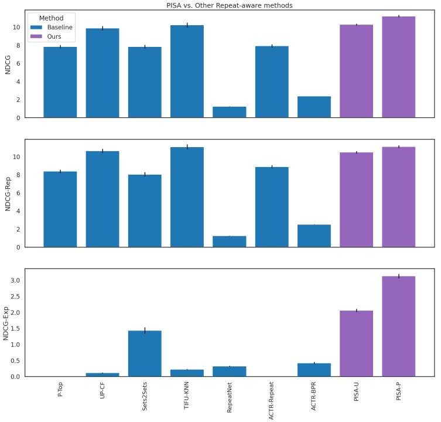
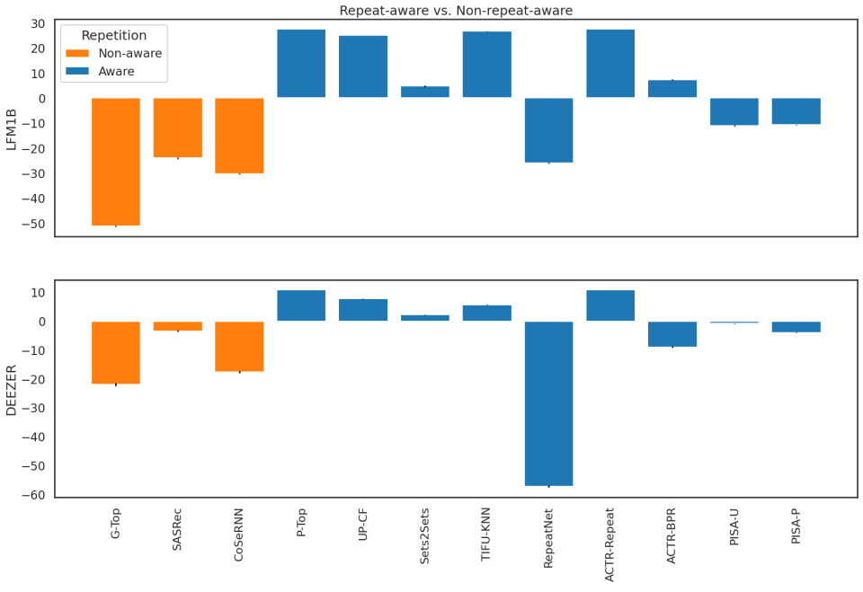
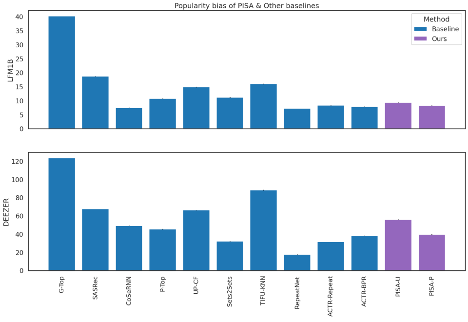
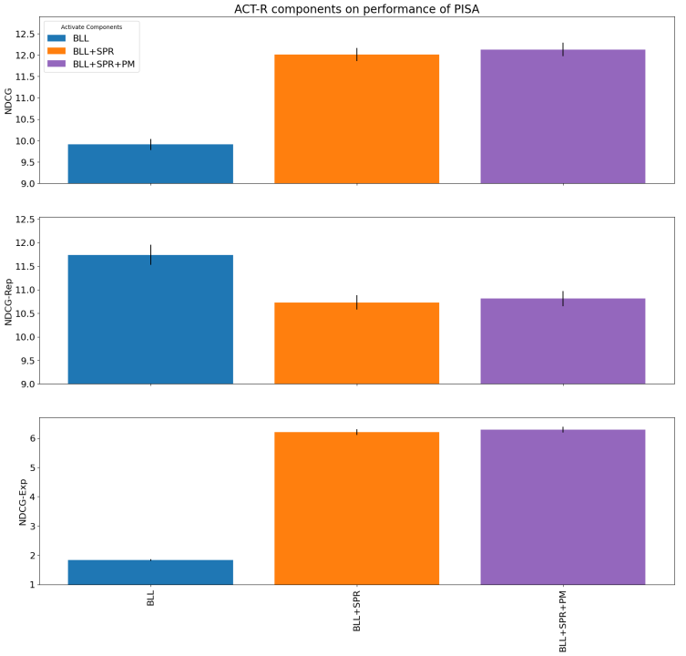

# Transformers Meet ACT-R: Repeat-Aware and Sequential Listening Session Recommendation

This repository contains the Zenodo link to our released proprietary dataset as
well as the Python code of our model from the paper **Transformers Meet ACT-R:
Repeat-Aware and Sequential Listening Session Recommendation**, accepted for
publication in the proceedings of the 18th ACM Conference on Recommender
Systems ([RecSys 2024](https://recsys.acm.org/recsys24/)). The paper is
available online [on arXiv](https://arxiv.org/abs/2408.16578).

## Environment

- python 3.9.13
- tensorflow 2.11.0
- tqdm 4.65.0
- numpy 1.24.2
- scipy 1.10.1
- pandas 1.5.3
- toolz 0.12.0

## Deezer Dataset

The original anonymized version of our Deezer proprietary dataset (before
filters applied in this work) can be freely downloaded
from [Zenodo](https://zenodo.org/records/13890194). This dataset contains over
700 million time-stamped listening events collected from 3.4M anonymised users
on Deezer streaming service, occurred between March and August 2022. It
includes 50k anonymised songs, among the most popular ones on the service as
well as their pre-trained embedding vectors, calculated by our internal model.
All files are in parquet format which could be read by using
`pandas.read_parquet` function.

## General Architecture


## Hyperparameters

Hyperparameters on each dataset are found in the corresponding
configuration file in `configs` directory.

## Experiments

### Pretrained Embeddings

For LFM1B, if the pretrained embeddings are used ("pretrained" in configuration
file
is set to "item", otherwise "nopretrained"), we first need to generate
pretrained embeddings as
following:

1. Download data and put it into `exp/data` directory. For example
   `exp/data/lfm1b`
2. From `recsys24-pisa` directory, run python scripts in `data_misc/lfm1b`
   directory in sequence (from 1 -> 5)
3. The output pretrained embeddings will be found in `exp/data/lfm1b`

For Deezer dataset, the pretrained embeddings are calculated beforehand by our
internal model and are provided alongside with user sessions.

### Main scripts

To run the experiments, from the root directory in the terminal (recsys24-pisa),
run the command `./script/run_pisa.sh`

### Some results

#### Repeat- vs. Non-repeat-aware

##### LFM1B



##### DEEZER


#### PISA vs. Other repeat-aware baselines

##### LFM1B



##### DEEZER



#### Repetition / Exploration Biases



#### Popularity Bias



### Role of ACT-R components



## Cite

Please cite our paper if you use this code in your own work:

```BibTeX
@inproceedings{tran-recsys2024,
  title={Transformers Meet ACT-R: Repeat-Aware and Sequential Listening Session Recommendation},
  author={Tran, Viet-Anh and Salha-Galvan, Guillaume and Sguerra, Bruno and Hennequin, Romain},
  booktitle = {Proceedings of the 18th ACM Conference on Recommender Systems},
  year = {2024}
}
```